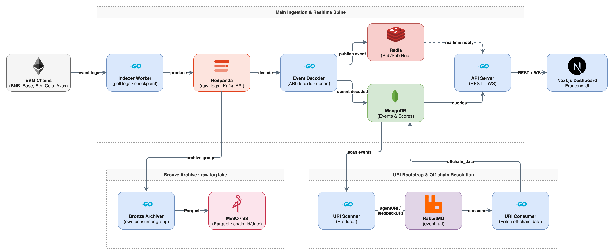
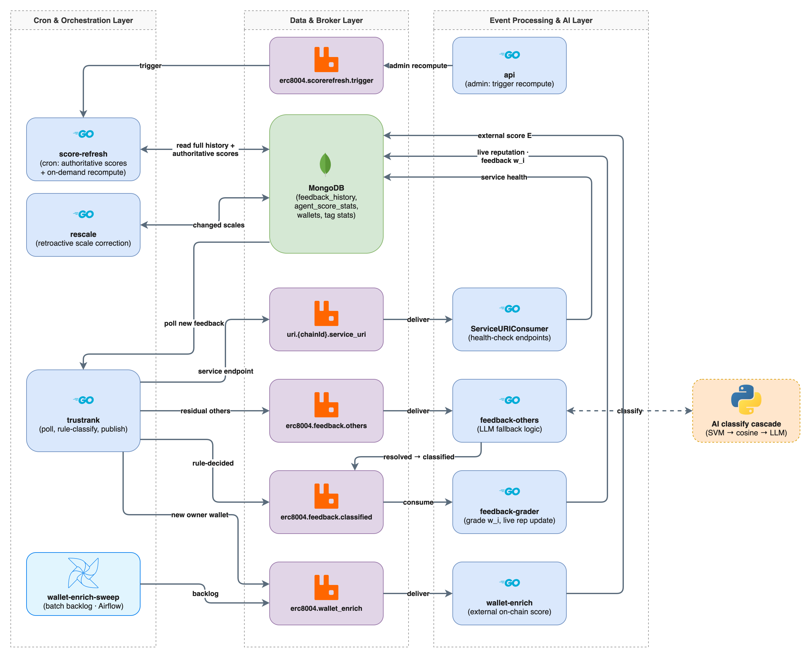

# erc-8004-benchmarking-be

Go backend for the [ERC-8004 agent benchmarking platform](https://github.com/StrongDZ/erc-8004-benchmarking-platform). It crawls ERC-8004 Identity and Reputation registry events from five EVM chains, classifies each feedback, computes agent reputation and WalletTrust scores, and serves the results over a REST + WebSocket API to the [dashboard](https://github.com/StrongDZ/erc-8004-benchmarking-fe). Feedback that the rule engine cannot decide is escalated to the [AI service](https://github.com/StrongDZ/erc-8004-ai-service).

**Stack:** Go 1.25 · MongoDB · Redis · RabbitMQ · Redpanda (Kafka API) · MinIO/S3 (Parquet) · go-ethereum · Swagger (swaggo)

## Workers

Each runtime binary lives under `cmd/workers/*`.

**Ingestion**

- `indexer` — EVM log crawler; produces raw, undecoded logs to the Redpanda `raw_logs` topic (the bronze source-of-truth log).
- `event-decoder` — Consumes `raw_logs`, decodes them to typed events, upserts MongoDB, and publishes Redis notifications for realtime fan-out.
- `bronze-archiver` — Consumes `raw_logs` with its own consumer group and archives raw logs to MinIO/S3 as partitioned Parquet (`raw/chain_id=/date=`), queryable by DuckDB/ClickHouse.
- `uri-bootstrap` — Scans decoded events per chain and resolves agentURI / feedbackURI (IPFS, HTTP, `data:`) into off-chain data via per-chain RabbitMQ queues.
- `oasf-schema-refresh` — Weekly refresh of the OASF skill/domain taxonomy into `oasf_skills` and `oasf_domains`.

**Classification and scoring**

- `trustrank` — Periodic full pass over decoded events per chain; processes identity events, rule-classifies decoded feedback, and computes TrustRank scores.
- `feedback-others` — Consumes the rule-undecided (`others`) residual and resolves its category with the AI service.
- `feedback-grader` — Consumes classified feedback, applies the validation gate and quality score, and live-updates each agent's reputation (a fast approximation).
- `score-refresh` — Replays `feedback_history` per agent on a cron to compute the authoritative reputation, 24h/7d/30d deltas, composite breakdown, and WalletTrust.
- `rescale` — Retroactively corrects feedback rows (value scale and re-derived category) when a tag's scale changes; scores are reconciled on the next replay.

**Wallets and API**

- `wallet-enrich` — Event-driven daemon (competing consumers, run N replicas) that enriches wallets with external on-chain signals: balance, age, counterparties, activity, ENS.
- `wallet-enrich-sweep` — Run-once batch that republishes wallets still needing enrichment to the `wallet_enrich` queue; meant to be scheduled by an orchestrator, not run as a daemon.
- `api` — REST API (`/api/v1`) and WebSocket hub (`/api/v1/ws`). OpenAPI spec in `docs/swagger.yaml`; admin endpoints require `X-API-Key`.

Tools under `cmd/tools/`: `classifier-bench-mongo`, `rule-coverage`, `sensitivity` (parameter sensitivity analysis), `wallet-external-backfill`, `restart-trustrank`, `mcp-server`, and others.

## Architecture

### Ingestion



### Scoring



Redis is used as a thin fan-out bus between the event-decoder and the API because the
two run as separate processes. Payload shape:

```json
{
  "type": "event.decoded",
  "eventName": "FeedbackCreated",
  "contractType": "reputation",
  "chainId": 8453,
  "agentId": "1435",
  "txHash": "0xabc…",
  "blockNumber": 12345,
  "logIndex": 2,
  "timestamp": 1770000000,
  "args": { "…": "…" }
}
```

Configure with `REDIS_URL` and `REDIS_EVENTS_CHANNEL` in `.env` (see
`.env.example`). Setting `REDIS_URL=""` disables realtime broadcast without
affecting REST endpoints.

## Local dev

```bash
cp .env.example .env
docker compose up -d mongo rabbitmq redis redpanda redpanda-init minio minio-init
go run ./cmd/workers/indexer
go run ./cmd/workers/event-decoder
go run ./cmd/workers/api
```

Host-run workers reach Redpanda at `localhost:19092` (`REDPANDA_BROKERS`); the Compose file overrides this to `redpanda:9092` for containerised workers. `docker compose up -d` also starts the remaining workers as services.

## Deployment

- `docker-compose.yaml` — full stack (stores + all workers); `wallet-enrich-sweep` runs under the `batch` profile.
- `deploy/k8s/` — Kubernetes manifests (namespace, stores/config, competing-consumer daemons, sharded singletons, API, batch CronJob).
- `deploy/airflow/` — Airflow project with the `scoring_pipeline` and `oasf_refresh` DAGs.
